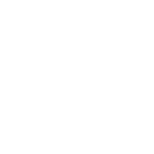

<!-- QORION LOGO -->
<picture>
  <source media="(prefers-color-scheme: dark)" srcset="assets/qorion-logo.svg" />
  <source media="(prefers-color-scheme: light)" srcset="assets/qorion-logo-dark.svg" />
  
</picture>

  

# WIKTORIA

**Frontend System Engineer · CEO @ Qorion**

 

Building enterprise SaaS platforms and management systems.
 
8+ years of frontend architecture. React.js Contributor.

---

<!-- STAT CARDS -->
<picture>
  <source media="(prefers-color-scheme: dark)" srcset="assets/stats-dark.svg" />
  <source media="(prefers-color-scheme: light)" srcset="assets/stats-light.svg" />
  
</picture>

  

<!-- TECH STACK -->
### Tech Stack

 

 

---

 

<!-- QORION -->
<picture>
  <source media="(prefers-color-scheme: dark)" srcset="assets/qorion-logo.svg" />
  <source media="(prefers-color-scheme: light)" srcset="assets/qorion-logo-dark.svg" />
  
</picture>
&nbsp;&nbsp;**QORION**

Enterprise SaaS · Management Platforms · Game Development

 

---

 

 

*"Code is architecture. Architecture is vision."*

