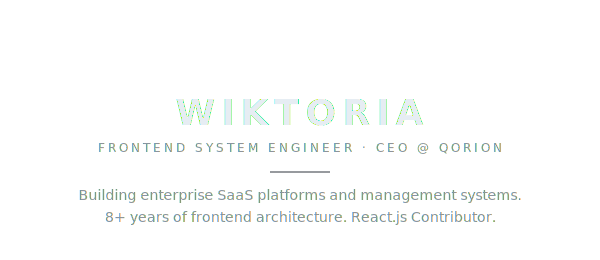
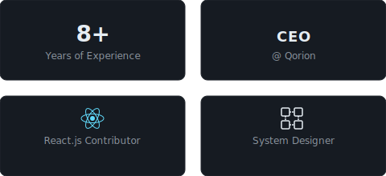
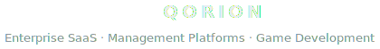
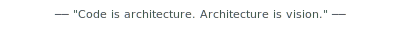

<!-- HERO -->
<picture>
  <source media="(prefers-color-scheme: dark)" srcset="assets/hero-dark.svg" />
  <source media="(prefers-color-scheme: light)" srcset="assets/hero-light.svg" />
  
</picture>

 

<!-- STAT CARDS -->
<picture>
  <source media="(prefers-color-scheme: dark)" srcset="assets/stats-dark.svg" />
  <source media="(prefers-color-scheme: light)" srcset="assets/stats-light.svg" />
  
</picture>

  

<!-- TECH STACK -->

  
  
  
  
  
  
  
  
  
  
  
  
  
  

 

<!-- QORION -->
<picture>
  <source media="(prefers-color-scheme: dark)" srcset="assets/qorion-section-dark.svg" />
  <source media="(prefers-color-scheme: light)" srcset="assets/qorion-section-light.svg" />
  
</picture>

 

<!-- CONTACT -->

 

<!-- FOOTER -->
<picture>
  <source media="(prefers-color-scheme: dark)" srcset="assets/footer-dark.svg" />
  <source media="(prefers-color-scheme: light)" srcset="assets/footer-light.svg" />
  
</picture>

